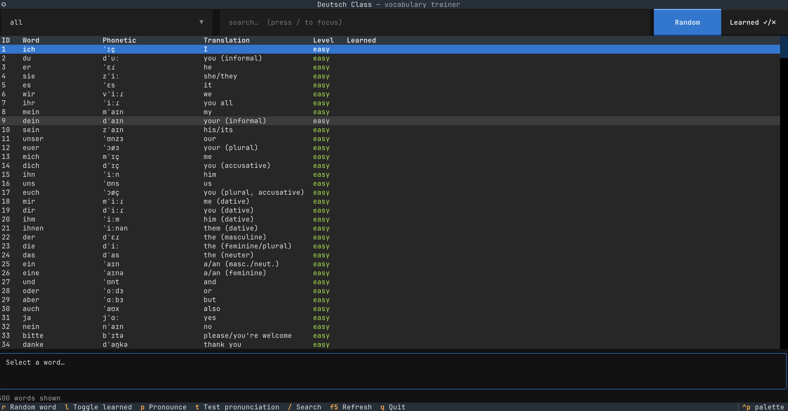

## Is there any need for yet another Language learning platform?

Having recently moved to Berlin, I wanted to practice and expand my German vocabulary,
I was struggling prioritizing between my German practise and ML projects. 
So I built **Deutsch Class**: a fully local German
learning app with a Postgres-backed vocabulary database, a FastAPI REST API,
and a terminal UI. Everything runs on my machine.



## Architecture

The whole thing is three small pieces:

```
┌───────────┐   HTTP    ┌──────────────┐   SQL    ┌────────────────┐
│  TUI      │ ────────► │  FastAPI     │ ───────► │  PostgreSQL    │
│ (Textual) │           │  api/main.py │          │  deutsch_class │
└───────────┘           └──────────────┘          └────────────────┘
```

- **PostgreSQL** stores ~1,000 words seeded from a JSON file (402 easy ·
  402 medium · 196 difficult), each with a phonetic transcription, English
  translation, and a `learned` flag.
- **FastAPI** exposes listing, search, filtering, CRUD, random draws, and stats.
- **Textual** drives the terminal frontend against the live API.

The schema is deliberately simple, with difficulty constrained at the database
level:

```sql
CREATE TABLE words (
    id          SERIAL PRIMARY KEY,
    word        TEXT NOT NULL,
    phonetic    TEXT,
    translation TEXT,
    difficulty  TEXT NOT NULL CHECK (difficulty IN ('easy', 'medium', 'difficult')),
    learned     BOOLEAN NOT NULL DEFAULT FALSE,
    UNIQUE (word, difficulty)
);
```

One entry point (`main.py`) starts the API and launches the TUI together, so
`uv run main.py` is all you need.

## The TUI

[Textual](https://textual.textualize.io/) made the terminal frontend genuinely
pleasant to build. The main screen has a filterable word table, a search box,
and a detail panel for the selected word.

Keybindings are kept minimal:

| Key  | Action                                            |
| ---- | ------------------------------------------------- |
| `r`  | Draw a random word                                |
| `l`  | Toggle learned on selected word                   |
| `p`  | Pronounce the selected word (TTS)                 |
| `t`  | Test pronunciation of the selected word (mic+ASR) |
| `/`  | Focus the search box                              |
| `F5` | Refresh the word list                             |
| `q`  | Quit                                              |

Random draw mode is where most of the studying happens — pull a random
unlearned word at your chosen difficulty, hear it spoken, mark it learned when
you've got it.

## Text-to-speech

Every word shown is announced aloud using macOS `say` with a German voice.
Pressing `p` replays the currently selected word. It's a tiny feature but it
completely changes how the app feels — you're not just reading, you're hearing
the language constantly.

## Pronunciation testing with on-device Whisper

This is the part I'm most happy with. Press `t` and the app records 3 seconds
from your microphone, transcribes the audio **locally** with
[mlx-whisper](https://github.com/ml-explore/mlx-examples/tree/main/whisper)
using `whisper-large-v3-turbo-german-f16` (a German-optimized model that runs
fast on Apple Silicon), then scores your attempt against the target word via
character-level edit distance:

- **≥ 80%** — green
- **50–79%** — yellow
- **< 50%** — red

No audio ever leaves the machine. The first run downloads the ~1.6 GB model;
after that it's instant.

## The API

The API is thin but complete — interactive docs come free with FastAPI at
`/docs`.

| Method | Endpoint                     | Description                                        |
| ------ | ---------------------------- | -------------------------------------------------- |
| GET    | `/words`                     | List/filter/search words                           |
| GET    | `/words/random`              | Random word (filter by difficulty, unlearned only) |
| POST   | `/words`                     | Create a word                                      |
| PATCH  | `/words/{id}`                | Update any subset of fields                        |
| POST   | `/words/{id}/toggle-learned` | Flip the learned flag                              |
| DELETE | `/words/{id}`                | Delete a word                                      |
| GET    | `/stats`                     | Counts per difficulty + learned + total            |

```bash
curl "localhost:8000/words/random?difficulty=easy&unlearned_only=true"
# {"word":"geradeaus","phonetic":"ɡərˈɑdeːˌaʊs","translation":"straight ahead",
#  "difficulty":"easy","id":294,"learned":false}
```

## What's next

- [ ] **Web frontend** — HTMX + CSS served by FastAPI, replacing the TUI as
      the primary client
- [ ] **Phrases** — full sentences with categories (ordering coffee,
      directions, shopping…) alongside single words
- [ ] **Listening & reading/writing exercises**
- [ ] **Spaced repetition** built on top of the `learned` flag

The code is on
[GitHub](https://github.com/lucas-hudsn/deutsch_class). If you have an Apple
Silicon Mac and a Postgres instance lying around, `uv sync && uv run main.py`
gets you using it right away.
