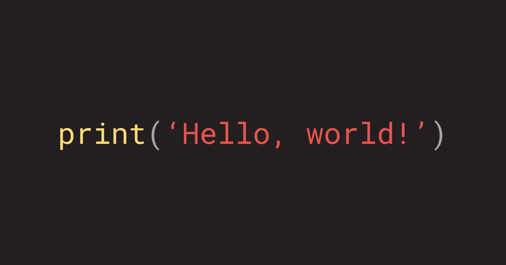

```{python}
print("Hello World!")
```

Welcome to my site. I'll be using this space to document personal projects and share thoughts on the tech industry, with a particular focus on ML, deep learning, and AI.

I plan to grow my skills across AI, ML, and full-stack engineering through self-directed projects — some built locally for fun, others I'll endeavour to host and maintain.

Most full-stack work will use Python/FastAPI paired with various frontends as I continue exploring them. My public ML development happens through Jupyter Notebooks, walking through model development step by step.

It's an exciting time in open-source engineering with powerful models dropping weekly. I'll endeavour to implement a wide range of models and frameworks against real-world use cases.

I plan to post at least weekly — check back if you're curious what I'm building. Thanks!

