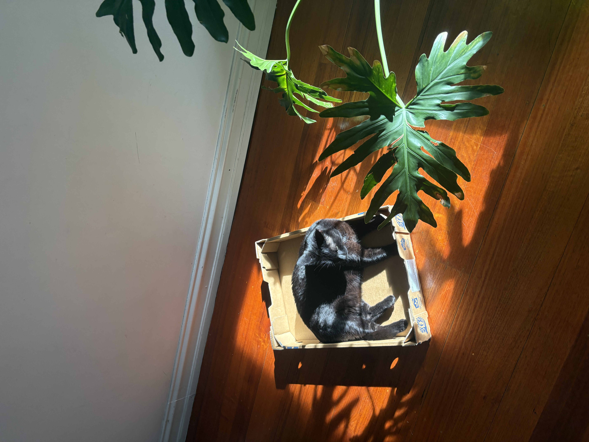

```{python}
print("Hello World!")
```

Welcome all to my website, I will be using this site to document my personal projects, blog about my thoughts and upload images of my travels

In 2026 I plan to further my development in AI and software engineering through self directed projects, some which will be built locally at my own leisure, and others which I will host and maintain with best engineering practices.

It is a very exciting time in open source engineering with many powerful models being released weekly, I will endevour to implement a wide range of open source models and frameworks that have real world use cases.

I plan on posting here at lease weekly so please keep checking in if you are interested in what I am building, Thanks!

