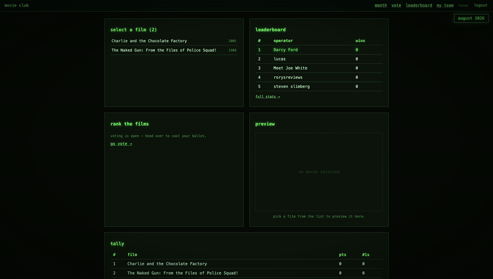
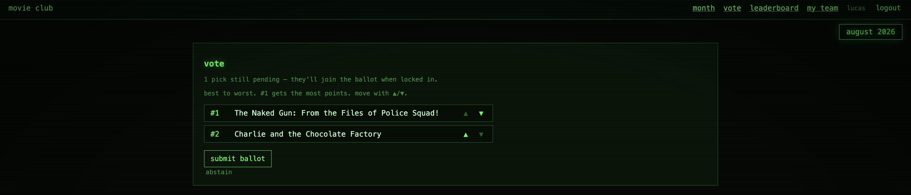
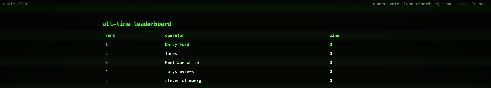

I spend most of my time as a data scientist / AI engineer: notebooks, models,
pipelines. But every model I ship eventually needs an actual application around
it, and my ability to build that part has always been limited. So I built
one from scratch: **Movie Club**, a server-rendered FastAPI app that runs a
monthly film competition for my friends and me.


*The dashboard — submission phase, phosphor-green CRT theme.*


## What is Movie Club?
Having moved from Melbourne to Berlin, I am no longer able to meet my friends for 
our monthly movie club competition, so I thought it is a good opportunity for 
my first deployed application to make an app for us.
### The Rules:
Every month each team member submits one movie. Everyone watches and ranks all
the picks best → worst. The top film wins; the bottom film sends its submitter
to the bench (they still vote next month, but can't submit). Repeat forever.

**Live:** <https://movieclub.fastapicloud.dev>


## The product

The whole thing runs on a three-phase cycle lifecycle:

1. **SUBMITTING** — each member picks one film via live search against the
   [OMDB API](https://www.omdbapi.com/). One pick per person, no duplicates.
2. **RANKING** — an admin locks submissions, then everyone drags their ballot
   into order with ▲▼ controls.
3. **CLOSED** — points are tallied by **Borda count**: position 1 of *N* films
   gets *N−1* points, last place gets 0. Winner crowned, loser evicted, next
   cycle auto-created.

Joining is invite-only via a team code, and an all-time leaderboard tracks wins
and losses per member.


*The `/vote` ballot page, built as HTMX partials so reordering never reloads the page.*


*The all-time leaderboard. Bragging rights are permanent.*

## The stack

I deliberately avoided React. The goal was to learn how a "real" web app works
at the request/response level, not to learn a frontend framework:

| Layer    | Choice |
|----------|--------|
| Hosting  | [FastAPI Cloud](https://fastapicloud.com) |
| Backend  | FastAPI + Jinja2 templates + HTMX fragments |
| Database | PostgreSQL via SQLAlchemy 2.0, Alembic migrations (Supabase in prod) |
| Auth     | Argon2 password hashing + signed session cookie (`itsdangerous`) |
| Movies   | OMDB API |
| Styling  | Hand-rolled CSS, black/phosphor-green CRT theme |

The architecture is refreshingly boring:

```
browser → router → SQLAlchemy model → template or redirect
```

Routes return either full pages or HTML fragments. HTMX swaps fragments into
placeholders (`#ballot`, `#search-results`) — no SPA, no client state, no build
step. For a voting app where interactions are small and local, this felt exactly
right.

## Next: Building a Recommender System

Here's the part I'm most excited about. This little club is quietly generating
a dataset:

- Every member's **full ranking of shared movies**, every month, indefinitely
- Implicit signals: abstentions, submission choices, win/loss history
- A growing matrix of *members × movies* with ordinal preferences

The obvious problem with a 6-person club is sparsity — six months in, we might
have 30 movies total. The fix: **Letterboxd exports**. Letterboxd lets any user
export their entire diary and ratings as CSV (title, year, rating, watched
date). Importing those gives every member hundreds of rated films immediately.

The plan:

1. Members upload their Letterboxd export (or connect via the unofficial API).
2. Normalize ratings onto a common scale and align with OMDB/IMDb IDs.
3. Train an implicit-feedback model (probably start with simple matrix
   factorization, then something like implicit ALS or a neural CF model) on the
   union of club rankings + Letterboxd ratings.

Suddenly the cold-start problem mostly disappears: a new member arrives with
years of taste already attached.