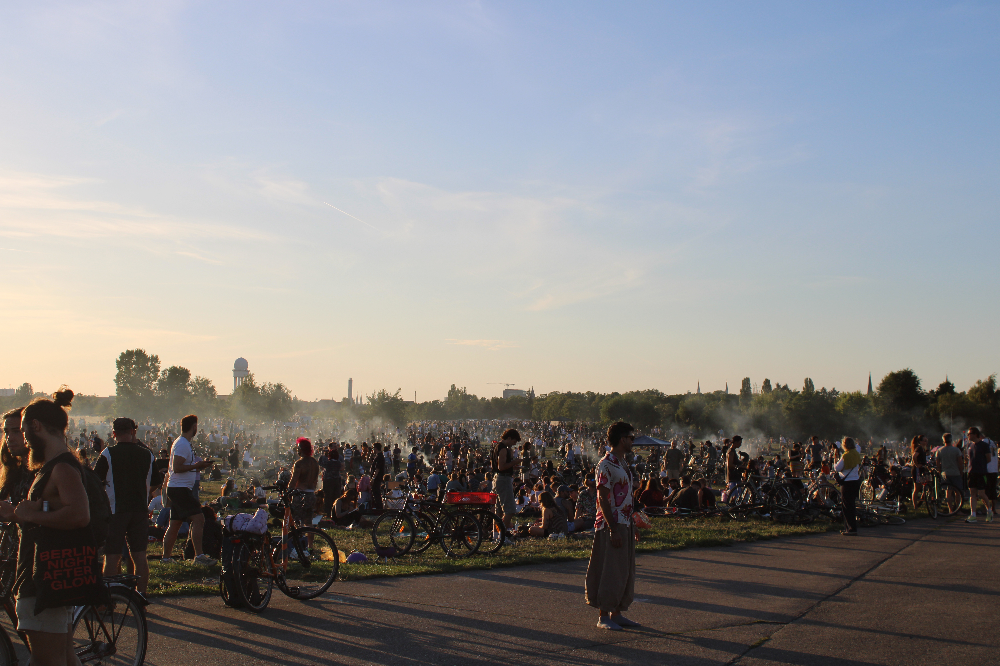

### Berlin - a Fresh Start

My partner and I have made the difficult decision to leave our lives, jobs and cat 🤕 in Melbourne, and journey over to Berlin for a new life and new experiences. The past 10 years in Melbourne (and Canberra) have been transformative, from High School graduates through to Masters-educated practising professionals in our respective fields (Data Science and Architecture) we cannot thank our home country enough for the opportunities and experiences.

However, we had always wondered what opportunities and lifestyle changes may come from moving overseas and always had a vague plan to seek them. Last year, we decided it was time to organise and make some definitive plans to move, Lucy exhausted herself building matrices that cross checked lifestyle and culturual factors with opportunities and cost of living. This allowed us to easily decide on Berlin as the city which suited us the best, and since then had built plans to move.

Now, having moved in just a week ago, it feels like we have made an excellent decision. Walking around the streets of Kreuzberg I am overcome with feelings of inspiration, excitement and spontanaeity. I am determined to build myself into this city through engaging with the many events, cultural experiences, meetups and work opportunities, as well as let the city educate and shape a new way of life for me and guide my approach in life decisions.

This brings me to resetting my blog, I decided the cheap efforted projects I have done in the past do not align with the new approach I want to use when building personal projects. I was to make use of my skills to build projects that:

- Serve the community
- Only use open source models
- Are taylored towards small local models
- Do not require big cloud providers
- I use myself

Aside from this, I want to be studying new areas of computer science and using this blog to collate my notes. So from this day onwards, expect posts much more frequently with fun projects I find enjoyable as well as my learnings.

First up, my next project being built is a local application users can practise German with, democratizing Voice and STT models to English speaking users learning German, as well as notes from my studies on [AI Ethics](https://ethics.fast.ai/).

Hopefully will post with an update again this week!

Lucas.