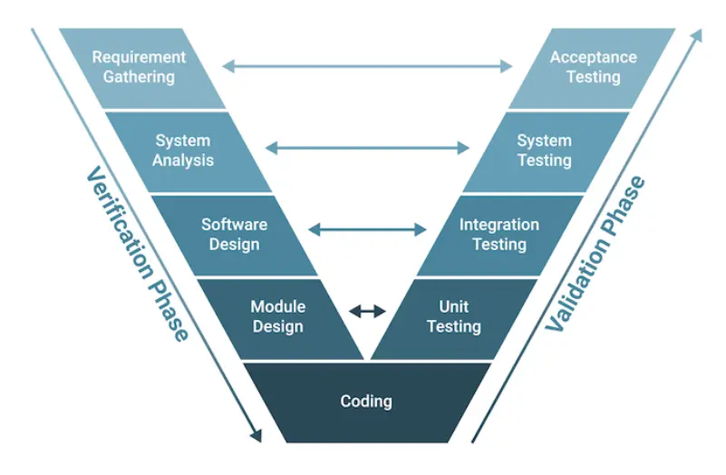

## V-Shape Development

V-Shape development was a popular approach to software development in the 1990s and early 2000s. It is a linear, sequential process that emphasizes the importance of testing and validation at each stage of development. The V-Shape model is often depicted as a V-shaped diagram, with the left side representing the development phases and the right side representing the testing phases.

### The 9 Phases

| # | Phase | Description |
|---|-------|-------------|
| 1 | **Requirements** | Gather and analyze requirements - functional and non-functional |
| 2 | **System Analysis** | Identify components, interactions, and high-level architecture |
| 3 | **Software Design** | Create detailed design documents and component interfaces |
| 4 | **Module Design** | Define data structures, algorithms, and function signatures |
| 5 | **Coding** | Write the actual code based on design documents |
| 6 | **Unit Testing** | Test individual modules with pytest and Vitest |
| 7 | **Integration Testing** | Test module interactions with TestClient |
| 8 | **System Testing** | End-to-end testing with Playwright |
| 9 | **Acceptance** | Demo to user and confirm against criteria |

The V-Shape model emphasizes the importance of testing and validation at each stage. This ensures high-quality software that meets user needs. However, it can be rigid and may not suit projects requiring rapid iteration.

---

## AI Orchestration

With the rise of AI in software development, I believe the V-Shape model now serves well as an orchestration format for AI engineering projects:

- **Left side of V**: Development and training phases of the AI model
- **Right side of V**: Testing and validation phases

This structured approach ensures AI models are developed systematically, with rigorous testing at each stage.

> **Note:** I built a series of commands that allow seamless progression through each stage. Find the repo [here](https://github.com/lucas-hudsn/vshape-orchestration).

---

## Stage Commands

Each command corresponds to a phase in the V-Shape model.

### Stage 1 — Requirements

> **Description:** V-model phase 1 — Requirements
> 
> Write down what the feature does, who uses it, inputs/outputs, acceptance criteria. Confirm with the user before moving on.
> 
> - **Artifact:** `docs/features/<feature-slug>/01-requirements.md`
> - **For new applications:** project scaffolding (uv init, Vite create, Postgres + Alembic baseline) — not a feature
> - **Before moving to `/stage2`:** commit artifact, advise user to run `/clear`. The doc on disk is the handoff.

### Stage 2 — System Design

> **Description:** V-model phase 2 — System design
> 
> API contract (FastAPI routes + schemas), DB tables/migrations, frontend screens + data flow. One short doc — no diagrams unless asked.
> 
> - **Prerequisite:** Read `docs/features/<feature-slug>/01-requirements.md`
> - **Artifact:** `docs/features/<feature-slug>/02-system-design.md`
> - **Matching validation phase:** `/stage8` (system tests)
> - **Before moving to `/stage3`:** commit artifact, advise user to run `/clear`

### Stage 3 — Architecture

> **Description:** V-model phase 3 — Architecture
> 
> Module layout: backend packages (`routers/`, `services/`, `models/`, `schemas/`), React component tree, shared types.
> 
> - **Prerequisite:** Read `01-requirements.md` and `02-system-design.md`
> - **Artifact:** `docs/features/<feature-slug>/03-architecture.md`
> - **Matching validation phase:** `/stage7` (integration tests)
> - **Before moving to `/stage4`:** commit artifact, advise user to run `/clear`

### Stage 4 — Module Design

> **Description:** V-model phase 4 — Module design
> 
> Function signatures, React component props/state, key SQL queries. Just enough to code from.
> 
> - **Prerequisite:** Read prior phase artifacts under `docs/features/<feature-slug>/`
> - **Artifact:** `docs/features/<feature-slug>/04-module-design.md`
> - **Matching validation phase:** `/stage6` (unit tests)
> - **Before moving to `/stage5`:** commit artifact, advise user to run `/clear`

### Stage 5 — Implementation

> **Description:** V-model phase 5 — Implementation
> 
> Write the code.
> 
> - **Prerequisite:** Read prior phase artifacts
> - **Artifact:** `docs/features/<feature-slug>/05-implementation.md` — key decisions, deviations, follow-ups
> - **Rule:** Red-green-refactor. Write the failing test first when practical; minimum write the test in the same change as the code.
> - **Before moving to `/stage6`:** commit artifact, advise user to run `/clear`

### Stage 6 — Unit Tests

> **Description:** V-model phase 6 — Unit tests
> 
> pytest for every service/util function; Vitest + RTL for every component with non-trivial logic.
> 
> - **Answers:** `/stage4` (module design)
> - **Prerequisite:** Read `04-module-design.md` and `05-implementation.md`
> - **Artifact:** `docs/features/<feature-slug>/06-unit-tests.md` — what's covered, what's not, how to run
> - **Before moving to `/stage7`:** commit artifact, advise user to run `/clear`

### Stage 7 — Integration Tests

> **Description:** V-model phase 7 — Integration tests
> 
> FastAPI `TestClient` against a real Postgres (Docker); frontend tests that hit a mocked or test API.
> 
> - **Answers:** `/stage3` (architecture)
> - **Prerequisite:** Read `03-architecture.md`
> - **Artifact:** `docs/features/<feature-slug>/07-integration-tests.md`
> - **Before moving to `/stage8`:** commit artifact, advise user to run `/clear`

### Stage 8 — System Tests

> **Description:** V-model phase 8 — System tests
> 
> End-to-end with Playwright: real backend, real DB, real browser. At least the golden path.
> 
> - **Answers:** `/stage2` (system design)
> - **Prerequisite:** Read `02-system-design.md`
> - **Artifact:** `docs/features/<feature-slug>/08-system-tests.md`
> - **Before moving to `/stage9`:** commit artifact, advise user to run `/clear`

### Stage 9 — Acceptance

> **Description:** V-model phase 9 — Acceptance
> 
> Demo to the user against the criteria from `/stage1`. **Do not start the next feature until the user explicitly accepts.**
> 
> - **Answers:** `/stage1` (requirements)
> - **Prerequisite:** Read `01-requirements.md`
> - **Artifact:** `docs/features/<feature-slug>/09-acceptance.md` — criteria ticked off, user's acceptance quote, date
> - **"Done" means:** acceptance criteria met, all four test levels passing, and user has said "accepted"

---

**Quick Reference Table**

| Dev Phase | Stage | Validation Phase | Test Type |
|-----------|-------|------------------|-----------|
| Requirements | `/stage1` | `/stage9` | Acceptance |
| System Design | `/stage2` | `/stage8` | System |
| Architecture | `/stage3` | `/stage7` | Integration |
| Module Design | `/stage4` | `/stage6` | Unit |
| Implementation | `/stage5` | — | — |

---

source /Users/lucashud/Desktop/projects/lucas-hudsn.github.io/.venv/bin/activate.fish