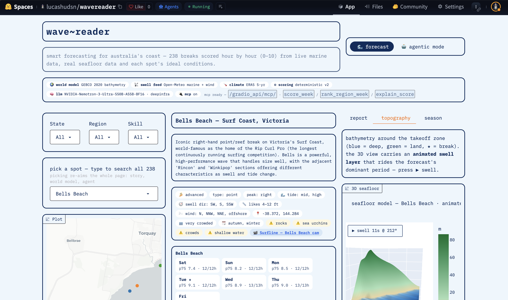

::: {.callout-tip}
## 🏆 NVIDIA GTC Berlin — Golden Ticket Winner

**wave~reader won a Golden Ticket to GTC Berlin** in the NVIDIA GTC golden ticket challenge — built on open weights (`nvidia/NVIDIA-Nemotron-3-Ultra-550B-A55B-BF16`) via Hugging Face Inference Providers.
:::

I built an agentic surf forecaster — **wave~reader** — and it won a Golden Ticket to **GTC Berlin**.

{ fig-align="center" }

::: {.column-screen style="width: 100%; max-width: 1700px; margin: 0 auto; display: flex; justify-content: center;"}
<iframe src="https://www.linkedin.com/embed/feed/update/urn:li:activity:7508054327152762880" height="800" width="60%" frameborder="0" allowfullscreen="" title="Embedded LinkedIn post - GTC Berlin Golden Ticket winners" style="display: block; margin: 0 auto; width: 60%; max-width: 600px; border-radius: 8px; border: none;"></iframe>
:::

**Live:** <https://huggingface.co/spaces/lucashudsn/wavereader>
**Code:** <https://github.com/lucas-hudsn/wavereader>

## What is wave~reader?

A surf-forecasting world model for the Australian coast: 238 breaks, 168 deterministic scores per spot, a 3D seafloor built from real GEBCO bathymetry — and one open model that narrates the numbers instead of inventing them.

Ask it *"where's good in NSW this weekend?"* and it reasons, calls tools, cites them, and narrates — it never makes up its own swell.

## One rule holds the whole app together

**The LLM never owns numbers.** Every wave height, wind reading, and 0–10 score comes out of plain deterministic Python — `wavereader/scoring.py`, `wavereader/openmeteo.py`, `wavereader/tools.py` — running over live Open-Meteo marine feeds + 5 years of ERA5 reanalysis.

The model's contract is to interpret those numbers, name the tool that produced them, and never compute a forecast itself. The agent can *recommend*; it can't *hallucinate a swell*.

## One screen, four instruments

No tabs. One surface, four synchronized instruments, one source of truth (`selected`):

1. **Map lens (left)** — all 238 breaks on a Plotly map, filtered by state / region / skill.
2. **Forecast story (center)** — 0–10 score for every hour of the next 7 days, score / swell / wind strips with weekend shading, then a smoothed 3D seafloor with animated swell riding the forecast's dominant period.
3. **Intel rail (right)** — field guide (peak type, ideal swell / wind / tide, hazards, crowd), 5-year ERA5 swell climate rose, wetsuit hint, nearby surf cams.
4. **Agent bar (full width)** — chat powered by smolagents `ToolCallingAgent` on Nemotron 3 Ultra. Every tool card shows latency in ms. Hard budget: 6 steps, 700 tokens a turn.

## The stack: NVIDIA open weights on Hugging Face rails

Every model call goes through one door — **Hugging Face Inference Providers**, served by DeepInfra — running `nvidia/NVIDIA-Nemotron-3-Ultra-550B-A55B-BF16`. No private APIs, one `HF_TOKEN`.

Around it, everything is open too: Open-Meteo forecasts, ERA5 reanalysis, GEBCO 2020 bathymetry via OpenTopoData, and a scoring engine you can read in one sitting.

## The app is the tool: MCP built in

`app.py` launches with `mcp_server=True`, so any MCP client can drive the deterministic engines directly at `<space-or-local-url>/gradio_api/mcp/`. Same three typed tools the agent uses:

- `score_week` — hourly 0–10 scores, daily bests, best window
- `rank_region_week` — every break in a region, ranked best-first
- `explain_score` — size / direction / wind / period breakdown of one hour

Everything else is registered with `api_name=False` on purpose — the MCP surface stays clean.

## Try it

- Live app: <https://huggingface.co/spaces/lucashudsn/wavereader>
- Contest entry: [LinkedIn post](https://www.linkedin.com/feed/update/urn:li:activity:7503872869848825856/)
- Winners: [LinkedIn post](https://www.linkedin.com/feed/update/urn:li:activity:7508054327152762880/)

::: {.column-screen style="width: 100%; max-width: 1700px; margin: 0 auto; display: flex; justify-content: center;"}
<iframe src="https://www.linkedin.com/embed/feed/update/urn:li:activity:7503872869848825856" height="1300" width="60%" frameborder="0" allowfullscreen="" title="Embedded LinkedIn post - GTC Berlin Golden Ticket winners" style="display: block; margin: 0 auto; width: 60%; max-width: 600px; border-radius: 8px; border: none;"></iframe>
:::

See you at GTC Berlin!
