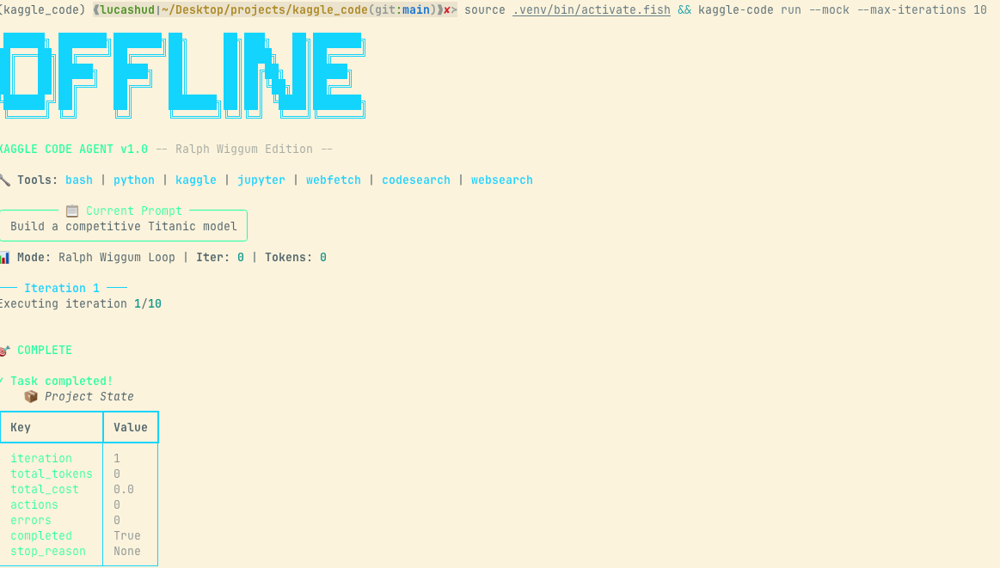

# Building an Autonomous Kaggle Coding Agent with Ralph Wiggum Loops

## Introduction

After spending countless hours on Kaggle competitions, I wanted to build something that could autonomously work on these problems while I slept.
The result is **Kaggle Code Agent** — a CLI tool that uses AI to iteratively solve Kaggle challenges using the Ralph Wiggum loop methodology.

## What is the Ralph Wiggum Loop?

The Ralph Wiggum loop is a methodology popularized by Geoffrey Huntley in 2025 for running autonomous AI coding agents. It works by:

1. Running an AI agent in a loop with a "stop hook" that intercepts exit attempts
2. Feeding errors back into the next iteration so the agent can fix them
3. Treating each iteration as a fresh context window
4. Persisting state via Git and the filesystem instead of relying on context memory

The key insight is that failures become data — if a test fails, the error message is fed back for the next iteration to fix. This allows for 14+ hour autonomous sessions.

## Architecture Overview

```
┌─────────────────────────────────────────────────────────────┐
│  KAGGLE CODE AGENT v1.0                                     │
├─────────────────────────────────────────────────────────────┤
│  ┌─ Tools ──────────────────────────────────────────────┐   │
│  │ bash | python | kaggle | jupyter | web | codesearch │   │
│  └──────────────────────────────────────────────────────┘   │
│  ┌─ Orchestrator ──────────────────────────────────────┐   │
│  │ Main Agent → Subagents (Data, Model, Feature, Eval) │   │
│  └──────────────────────────────────────────────────────┘   │
│  ┌─ Ralph Wiggum Loop ─────────────────────────────────┐   │
│  │ Context → Execute → Log → Check Limits → Repeat    │   │
│  └──────────────────────────────────────────────────────┘   │
└─────────────────────────────────────────────────────────────┘
```

## Key Features

### 1. Tool Integrations

The agent has access to multiple tools:
- **bash**: Execute shell commands
- **python**: Run Python scripts
- **kaggle**: Competition CLI (download data, submit)
- **jupyter**: Notebook management
- **webfetch**: Web scraping for competition details
- **codesearch**: Search code examples via Exa
- **websearch**: Research solutions

### 2. Subagent System

The orchestrator can spawn specialized subagents:
- **Data Engineer**: Data loading, cleaning, preprocessing
- **Model Trainer**: Training, hyperparameter tuning
- **Feature Engineer**: Feature creation and selection
- **Evaluator**: Cross-validation, interpretation

### 3. Context Compaction

At 70% context limit, the system:
- Keeps recent messages and artifacts
- Summarizes old context
- Preserves critical errors and scores

### 4. State Persistence

```
project/
├── PROMPT.md          # Task definition
├── state.json         # Runtime state (tokens, cost, scores)
├── history/           # Iteration logs
│   ├── iter_0001.md
│   └── iter_0002.md
├── artifacts/         # Models, plots
└── config.yaml        # Project config
```

## Implementation Highlights

### CLI with Typer and Rich

The terminal UI uses a cyberpunk aesthetic with neon colors:

```python
NEON_GREEN = "#00ff9f"
NEON_MAGENTA = "#ff00ff"
NEON_CYAN = "#00d4ff"
```



### Tool Execution Pattern

```python
result = tool_registry.execute("bash", "ls -la")
if result.success:
    print(result.output)
else:
    print(f"Error: {result.error}")
```

### Agent Response Parsing

The agent outputs structured responses:

```xml
<thinking>Analyzing the data...</thinking>
<action>python: train_model.py</action>
<result>Accuracy: 0.85</result>
<promise>COMPLETE</promise>
```

## Usage

```bash
# Initialize project
kaggle-code init -c titanic -p "Build a competitive model"

# Run with mock (no API key needed)
kaggle-code run --mock --max-iterations 10

# Run with real model
kaggle-code run --max-iterations 100 --max-time 120 --max-cost 50

# Fetch competition details
kaggle-code comp titanic

# Search HuggingFace
kaggle-code hf "bert sentiment classification"
```

## Cost and Performance

The Ralph Wiggum loop can consume significant API tokens:
- Small tasks: $5-20
- Medium tasks: $20-50
- Large tasks: $50-100+

The key is setting appropriate limits (`--max-iterations`, `--max-cost`) and monitoring progress.

## Future Improvements

- **Better context compaction**: More intelligent summarization
- **Checkpointing**: Save/restore loop state
- **Human-in-the-loop**: Pause for approval on certain actions
- **Multi-model support**: Claude, GPT-4, local models

## Conclusion

Building this agent was a fascinating exploration of autonomous AI systems. The Ralph Wiggum loop is a powerful pattern for tasks that are mechanical and verifiable — perfect for Kaggle competitions. While not suitable for creative or architectural decisions, it's excellent for iterative, goal-oriented work.

The full source code is available on GitHub, and I'm always looking for contributors to help improve the agent's capabilities.

---

*Built with Python, Typer, Rich, and Minimax 2.5*
