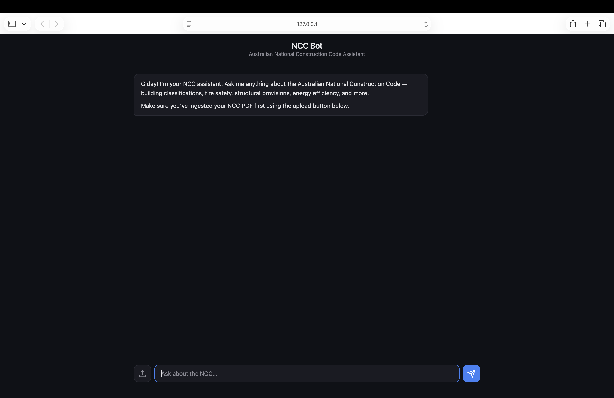
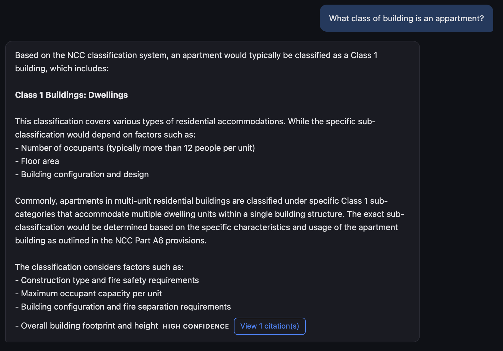
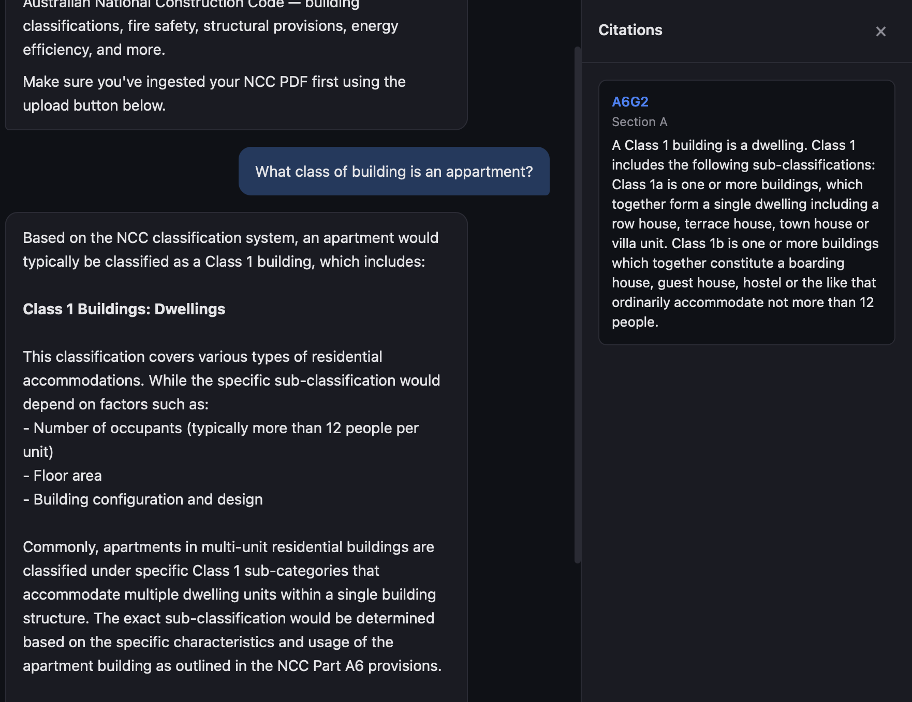

# NCC Bot

An agentic RAG system for querying the Australian National Construction Code (NCC). Built for architects, project managers, engineers, and building professionals who need fast, accurate answers with clause-level citations.

## How It Works

1. **Ingest** — Download NCC volumes directly from [ncc.abcb.gov.au](https://ncc.abcb.gov.au), or upload your own PDFs. The system parses them with PyMuPDF/pdfplumber, semantically chunks the text while respecting clause boundaries, embeds the chunks, and stores them in ChromaDB.
2. **Query** — Ask a question through the chat UI. A PydanticAI agent retrieves relevant chunks from the vector store, self-grades their relevance, and optionally rewrites the query and re-retrieves if results are insufficient (up to 3 attempts).
3. **Answer** — The agent generates a cited answer referencing specific NCC clauses, streamed to the frontend via SSE.

## Stack

| Component | Technology |
|---|---|
| LLM | Local Ollama (default: glm-4.7-flash) |
| Vector DB | ChromaDB |
| Embeddings | Local `google/embeddinggemma-300m` via sentence-transformers |
| PDF Parsing | PyMuPDF + pdfplumber |
| Chunking | semchunk (semantic) |
| Backend | FastAPI, Python |
| Frontend | Vanilla HTML, CSS, JS |



## Project Structure

```
ncc-bot/
├── main.py                     # FastAPI app and routes
├── app/
│   ├── config.py               # Settings (env vars, defaults)
│   ├── models.py               # Pydantic request/response schemas
│   ├── agent.py                # PydanticAI agent with RAG tools
│   ├── ingest/
│   │   ├── parser.py           # PDF parsing + NCC PDF downloading
│   │   ├── chunker.py          # Semantic chunking with clause boundaries
│   │   ├── embedder.py         # Embedding generation + ChromaDB storage
│   │   └── cli.py              # CLI for batch PDF ingestion
│   └── retrieval/
│       └── store.py            # ChromaDB query interface
├── frontend/
│   ├── index.html              # Chat UI
│   ├── style.css               # Styles
│   └── app.js                  # SSE streaming, rendering, file upload
├── data/                       # NCC PDF files (gitignored)
└── chroma_db/                  # Persistent vector store (gitignored)
```

## Agentic RAG Loop

The PydanticAI agent has two tools:

- **`retrieve_chunks`** — Semantic search over ChromaDB with optional volume/section filters.
- **`rewrite_query`** — Reformulates a query when retrieved chunks are insufficient.

The agent decides autonomously whether to rewrite and re-retrieve based on the quality of initial results. This loop runs up to 3 retrieval attempts before generating a final answer.



