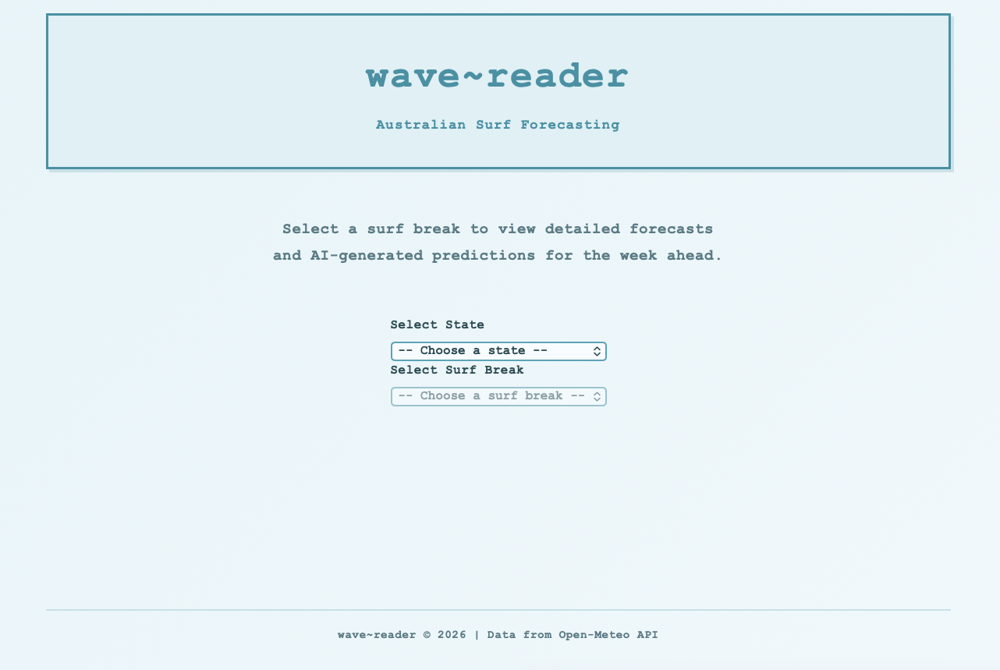
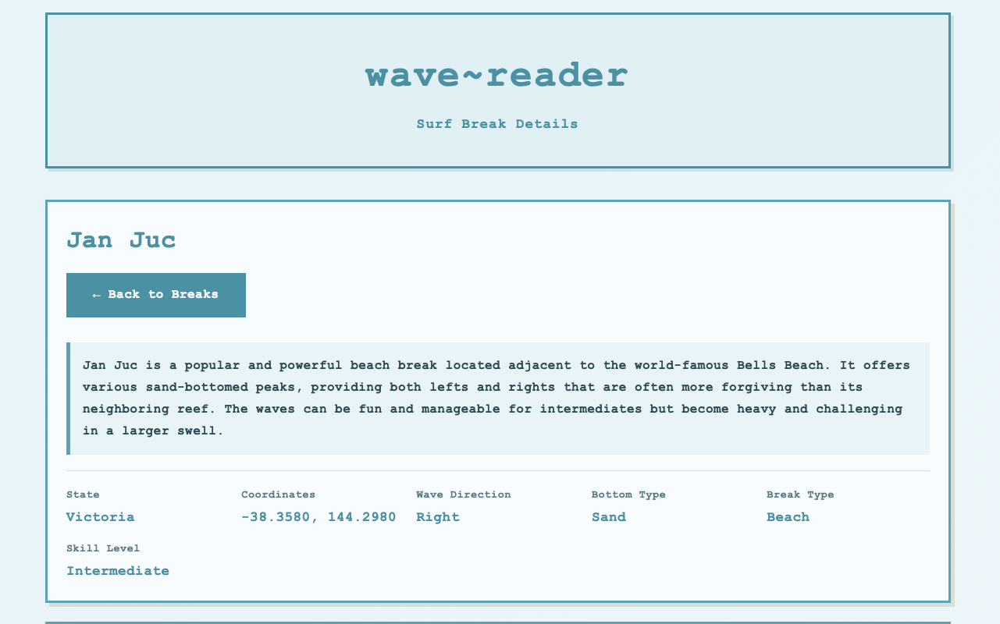
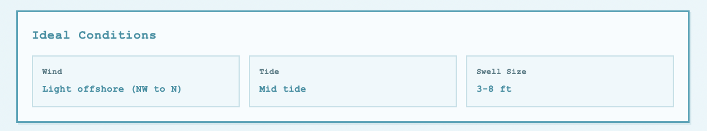
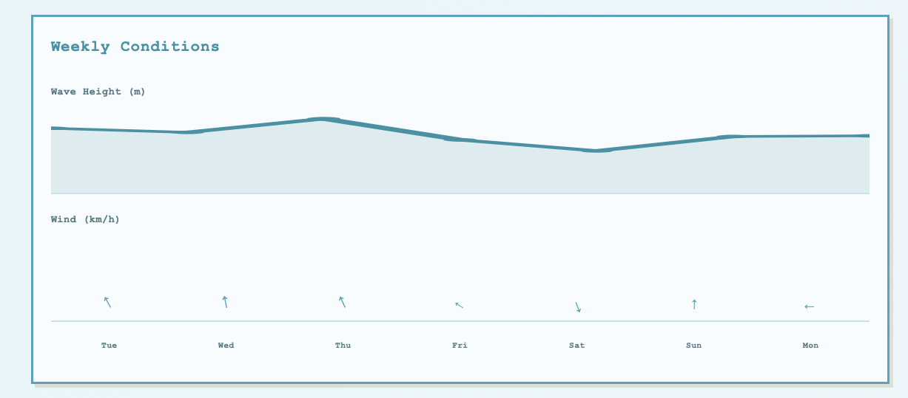
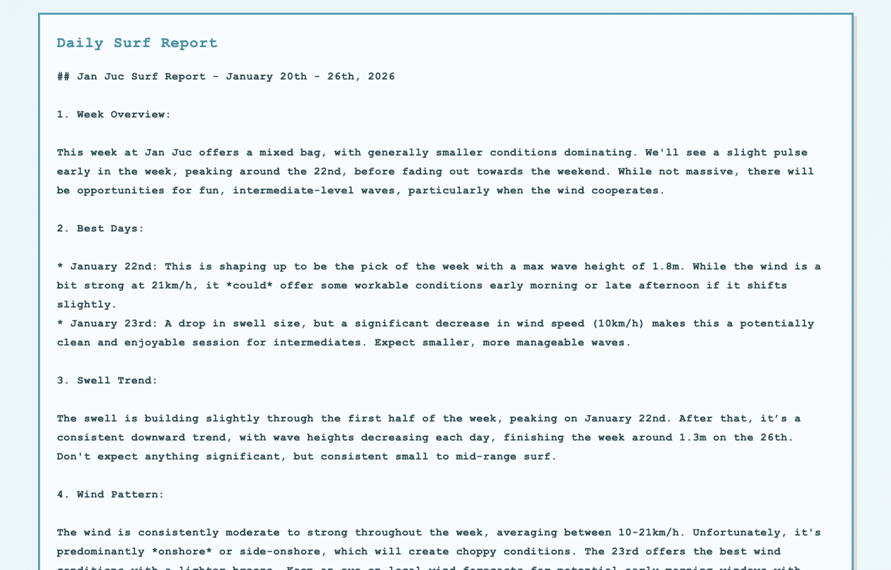

# wave~reader

A full-stack web application that delivers AI-powered surf forecasts for 50+ Australian surf breaks. This project demonstrates end-to-end engineering—from database design and API architecture to real-time data integration and generative AI implementation.

## Architecture Overview

```
┌─────────────────────────────────────────────────────────────────┐
│                         Frontend                                │
│  Vanilla JS  •  Dynamic SVG Charts  •  Responsive CSS           │
└──────────────────────────┬──────────────────────────────────────┘
                           │
┌──────────────────────────▼──────────────────────────────────────┐
│                      FastAPI Backend                            │
│  RESTful API  •  Jinja2 Templates  •  Request Orchestration     │
└───────┬─────────────────────────────────────────────┬───────────┘
        │                                             │
┌───────▼───────┐  ┌─────────────────┐  ┌─────────────▼───────────┐
│    SQLite     │  │   Open-Meteo    │  │     Google Gemini       │
│   Database    │  │   Marine API    │  │    Generative AI        │
└───────────────┘  └─────────────────┘  └─────────────────────────┘
```

## Full Stack Engineering

### Backend (FastAPI + Python)

The backend serves as the orchestration layer, coordinating between the database, external APIs, and AI services:

- **RESTful API Design**: Clean endpoint structure with proper separation between data retrieval (`/api/states`, `/api/break/{name}`) and page rendering (`/{state}/{break_name}`)
- **Async Request Handling**: Concurrent fetching of marine and weather data from Open-Meteo to minimize response latency
- **Template Rendering**: Server-side HTML generation with Jinja2 for fast initial page loads and SEO benefits

### Database Layer (SQLite)

A curated SQLite database stores detailed surf break metadata:

- Geographic coordinates for weather API queries
- Break characteristics (wave direction, bottom type, optimal conditions)
- Skill level classifications and hazard information

### Frontend (Vanilla JavaScript)

Built without frameworks to keep the bundle size minimal:

- **Dynamic SVG Charts**: Client-side rendering of weekly wave height and wind speed visualizations
- **Progressive Enhancement**: Core content works without JavaScript; charts enhance the experience
- **Responsive Design**: Mobile-first approach with a retro monospace aesthetic

## AI Engineering

### Generative Forecasting with Google Gemini

The core differentiator is the AI-generated surf reports. Rather than displaying raw weather data, the application synthesizes multiple data sources into natural language forecasts:

**Input Context Assembly**:
```
Break metadata (direction, bottom, skill level)
    + 7-day marine forecast (swell height, period, direction)
    + 7-day weather forecast (wind speed, direction, precipitation)
    = Structured prompt for Gemini
```

**Prompt Engineering**: The system constructs prompts that include:
- Break-specific characteristics that affect wave quality
- Temporal context (which days look best)
- Safety considerations based on skill level requirements

**Output**: Human-readable surf reports that interpret the data in context—explaining *why* Tuesday looks better than Wednesday, not just that the swell is bigger.

## Key Technical Decisions

| Decision | Rationale |
|----------|-----------|
| FastAPI over Flask | Native async support for parallel API calls |
| SQLite over PostgreSQL | Single-file deployment, sufficient for read-heavy workload |
| Vanilla JS over React | Minimal interactivity needs; faster load times |
| Server-side rendering | Better SEO, faster first contentful paint |
| Gemini over local models | Quality of natural language output; managed infrastructure |

## API Endpoints

| Endpoint | Method | Description |
|----------|--------|-------------|
| `/api/states` | GET | Returns all states with available surf breaks |
| `/api/break/{name}` | GET | Full break details + weather data + AI forecast |
| `/{state}/{break_name}` | GET | Rendered HTML page for a specific break |





